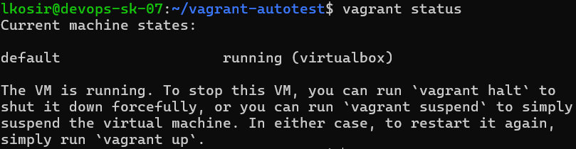
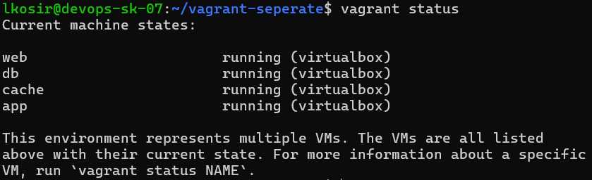

# DevOps domača naloga 1 – Taprav FRI

## Namen projekta
Avtomatizirana postavitev spletne aplikacije Taprav FRI z uporabo Vagrant in Cloud-init. Projekt vključuje:

- Monolitna postavitev z Vagrantom (1 VM)
- Ločena postavitev z Vagrantom (več VM)
- Cloud-init postavitev

## Struktura
Repozitorij vsebuje 3 mape in README.md:
```text
├── vagrant/
│   ├── skupaj/
│   │   ├── Vagrantfile
│   │   └── provision.sh
│   ├── loceno/
│   │   ├── Vagrantfile
│   │   ├── app.sh
│   │   ├── web.sh
│   │   ├── db.sh
│   │   └── cache.sh
├── cloud-init/
│   └── cloud-config.yaml
├── screenshots/
├── README.md
```
# Vagrant

## Arhitektura

### Monolitna postavitev
- Ena VM, kjer tečejo vsi servisi:
  - Frontend (Node.js)
  - Backend (Apache server + php api)
  - MySQL baza
  - Redis

### Ločena postavitev
- `app`: frontend
- `web`: backend (in spletni strežnik)
- `db`: MySQL
- `cache`: Redis

### Omrežne povezave
- Frontend → Backend: port 80
- Backend → MySQL: port 3307
- Backend → Redis: port 6379

Pri ločeni postavitvi so notranji IP naslovi virtualk od 192.168.56.10 do 192.168.56.13:
- web   192.168.56.10
- db    192.168.56.11
- cache 192.168.56.12
- app   192.168.56.13

Dodatno so konfigurirane naslednje spremembe za omrežje pri ločeni postavitvi:
- web: uporabnik iz root na user, ip iz 127.0.0.1 na 192.168.56.12
- db: odkomentiran bind adress 0.0.0.0
- app: sprememba naslova backenda iz localhost:80 na 192.168.56.11:80
- cache: bind odkomentiran in protected mode na no

POMEMBNO:
porti morajo biti pravilno nastavljeni, da aplikacija dela. Če je kakšen port že zaseden in dodeli drugega, bo prišlo do težav z prikazevanjem vsebine ali pa pri komunikaciji med komponentami

## Provisioning skripte

#### skupaj/provision.sh
- Namesti vse komponente (Node.js, Apache, PHP, MySQL, Redis)
- Klonira repozitorij aplikacije
- Konfigurira vse servise za delovanje na eni VM

#### loceno/app.sh
- Namesti Node.js
- Klonira frontend
- Pripravi okolje za zagon Next.js aplikacije

#### loceno/web.sh
- Namesti Apache in PHP
- Klonira backend
- Konfigurira povezavo do baze in Redis

#### loceno/db.sh
- Namesti MySQL
- Ustvari bazo in uporabnika
- Uvozi začetne podatke

#### loceno/cache.sh
- Namesti Redis
- Konfigurira dostop (bind, protected mode)

## Zahteve
- Linux
- Vagrant
- VirtualBox
- SSH dostop (tuneliranje)
- Brskalnik


## Navodila za zagon

### Monolitna postavitev
```bash
cd vagrant/skupaj
vagrant up
vagrant ssh
cd /srv/frontend
node server.js
```
Aplikacija dostopna na: https://localhost:3000 (prek SSH tunela)

### Ločena postavitev
```bash
cd vagrant/loceno
vagrant up --parallel
vagrant ssh app
cd /srv/frontend
node server.js
```
Aplikacija dostopna na: https://localhost:3000
### SSH tunel za dostop do portov
```bash
ssh -L 3000:localhost:3000 -L 8080:localhost:80 user@host
```

### HTTPS konfiguracija
Ker aplikacija in izpostavljena internetu so certifikati samopodpisani.
Deluje na portu 3000.

### Komponentne nastavitve (vse vključeno v skripte)
MySQL

    Uporabnik: user
    Geslo: skrito123
    Baza: taprav_fri

Redis

    Konfiguracija: /etc/redis/redis.conf
    bind 0.0.0.0
    protected-mode no

Backend

    Port: 80
    nahaja na /var/www/html/taprav-fri
    Povezava do baze in redis prek IP-jev ostalih VM-ov pri ločeni postavitvi, pri monolitni preko localhost portov.
    API URL: http://localhost:3000/taprav-fri/api/

Frontend

    Next.js aplikacija, nahaja se na /srv/frontend
    Port: 3000
    

Avtomatizacija

    - Vagrant provisioning skripte: provision.sh
    - Cloud-init konfiguracija: cloud-config.yaml
    - Skripte avtomatizirajo vse, edino kar je potrebno je zagnati frontend z ssh na VM.

Varnost

    - Dostop samo s SSH
    - HTTPS omogočen, vendar samo samopodpisani certifikati, saj aplikacija ni izpostavljena internetu
    - MySQL in Redis dostop omejen na notranje omrežje, dostop ima samo backend

Pospešitev

    - Deployment traja dolgo, saj mora posodobiti in pridobiti vse potrebne komponente. To se da pohitriti z boxi, ki imajo že naložene vse potrebne stvari, za prenos in zagon aplikacije.
    - Če se uporablja boxe, se zakomentira prvi dve vrstici vseh provision skript, da se ne posodablja po nepotrebnem.
    - Zaradi specifične verzije se npm ne da namestiti z apt get.

## Posnetki zaslona

UI aplikacije: 
!screenshots/ui.png
Vagrant status: 
Skupaj:


Ločeno:


Asciinema posnetki: 
[skupaj](screenshots/skupaj.case)
[narazen](screenshots/narazen.cast)


---
